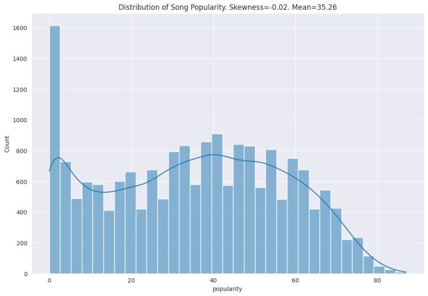
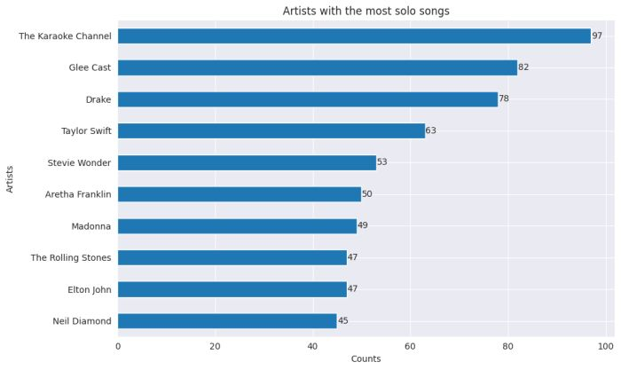
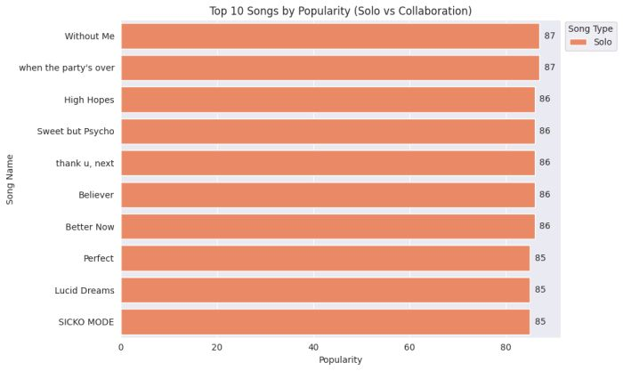
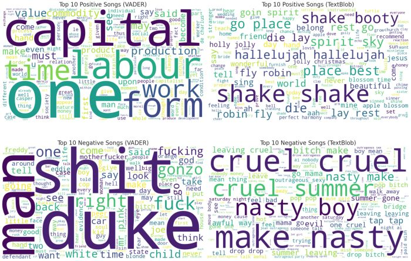
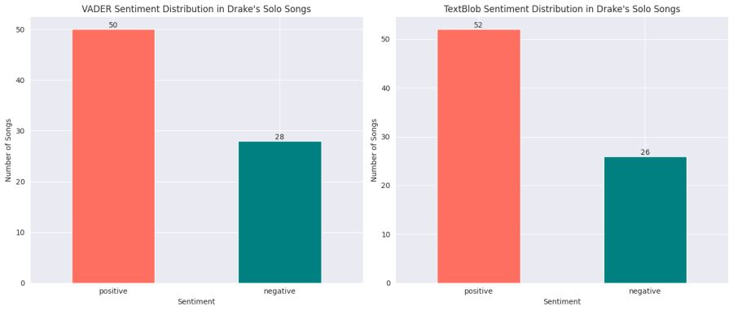
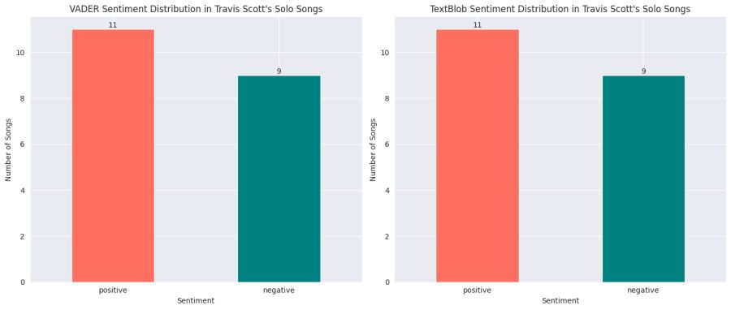
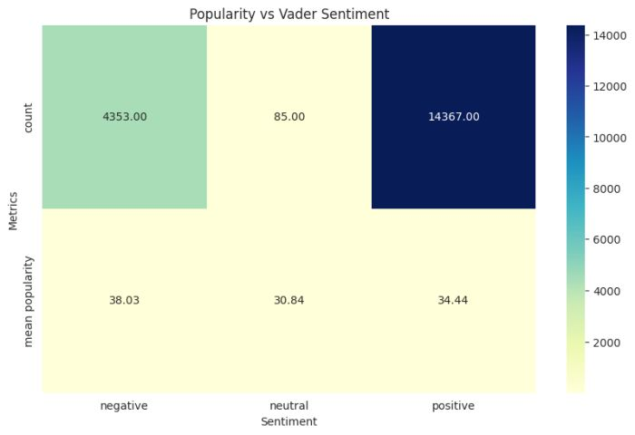

<h1 align="center">Sentiment Analysis of Spotify Songs</h1>

Analyzing sentiment in Spotify music dataset using natural language processing

Credit: HQDwalls

You can view the deployed application here: <a href="https://sentiment-analysis-spotify-18176c1c34a1.herokuapp.com/" target="_blank">https://sentiment-analysis-spotify-18176c1c34a1.herokuapp.com</a>  
Note: This application is hosted on a student account. It will stop working when I exhaust my credits 😑

<h2>Table of Contents</h2>

- [Introduction](#intro)
- [Problem Statement](#problem_statement)
- [Dataset](#data)
- [Data Preparation](#data_preparation)
- [Exploratory Data Analysis](#eda)
- [Sentiment Analysis Overview](#sentiment_analysis_overview)
- [Key Observations from Sentiment Analysis](#key_observations)

<h2>Introduction</h2>

This project focuses on analyzing the sentiment of song lyrics from Spotify and examining their correlation with song popularity and genre. By leveraging various datasets and employing natural language processing (NLP) techniques, we aim to uncover patterns and insights into how the sentiment of lyrics influences the popularity of songs. The project also explores how acoustic features and song metadata can be integrated to provide a comprehensive understanding of these relationships.

<h2>Problem Statement</h2>

Music is a universal language, and song lyrics play a crucial role in conveying emotions. Understanding the sentiment in lyrics and its relationship with song popularity can provide valuable insights for artists, producers, and marketers. This project addresses the following key questions:

- How does the sentiment of song lyrics correlate with song popularity?
- Are there noticeable patterns in sentiment across different music genres?
- Is there any relationship between the acousticness of a song and its sentiment? 

<h2>Dataset</h2>

The dataset used in this project is the MusicOSet dataset, which contains song metadata, acoustic features, and lyrics for over 20,000 songs from Spotify. The dataset includes information such as song title, artist, genre, popularity, tempo, key, and time signature. The lyrics are provided in text format, which allows for sentiment analysis using natural language processing techniques. The key datasets pertinent to out analysis are

- <b>Songs Dataset</b>: Provides comprehensive information about each song, including its title, artist, popularity, and other relevant details.
- <b>Lyrics</b>: Contains the lyrics corresponding to each song.
- <b>Acoustic Features</b>: Encompasses acoustic attributes such as song loudness, liveness, and more.

<h2>Data Preparation</h2>

After acquiring the necessary datasets, the subsequent phase involved data preparation, which includes the following steps:

- 
<b>Merging</b>: Firstly, we merged the three datasets based on a common identifier, the song ID, to consolidate all relevant information into a cohesive dataset.

- 
<b>Formatting artist names</b>: Originally, artist names were structured using a dictionary format where unique artist IDs were paired with corresponding artist names. This accommodated both solo artists and collaborations, ensuring clarity and consistency in the dataset. Our cleaning step here involved using a string of artist name only and a list of artists in case of collaborated songs

- 
<b>Removing songs without lyrics</b>: We proceeded by filtering out songs that did not have any associated lyrics, as these were not relevant to our analysis.

- 
<b>Eliminating duplicate lyrics</b>: To maintain data integrity, we identified and removed any duplicate entries in the lyrics dataset.

- 
<b>Text preprocessing</b>: The final step involved preprocessing the lyrics data. This entailed standard text cleaning procedures such as tokenization, removal of topwords (including additions like 'chorus' and 'verse'), conversion to lowercase, elimination of punctuation and escape characters, and finally, lemmatization to normalize the text for subsequent analysis.

<h2>Exploratory Data Analysis</h2>
<h3>Song Popularity</h3>

Our first exploratory data analysis step was to visualize the distribution of song popularity and were able to infer the following

- The tallest bar on the far left indicates a high count of songs with low popularity scores (close to 0). This shows that while many songs are produced, only a small fraction achieve high popularity. 
- The mean (average) popularity score is 35.26. This suggests that, on average, songs have a popularity score of around 35.26.
- The skewness value of -0.02 indicates that the distribution of song popularity is nearly symmetrical, with a very slight tendency towards left skewness.

<h3>Artists with Most Solo Songs</h3>

🎵 The Karaoke Channel tops the list with 97 solo songs, followed by Glee Cast with 82 and Drake with 78. Other notable artists include Taylor Swift (63), Stevie Wonder (53), and Aretha Franklin (50). 🎵

<h3>Songs with the Highest Popularity</h3>

“Without Me” by Halsey and “When the Party’s Over” by Billie Eilish are tied as the most popular songs. Notably, the top 10 songs are all solo tracks, suggesting that solo performances may have a higher likelihood of becoming hits. 🎵🌟

<h2>Sentiment Analysis Overview</h2>

Our sentiment analysis aimed to answer several business questions, including:

- <b>Artist Sentiment Trend</b>: Is there a trend towards more positive or negative sentiment over time for specific artists?
- <b>Song Sentiment vs. Popularity</b>: Does the sentiment of lyrics correlate with song popularity?
- <b>Explicit Content and Sentiment</b>: How does sentiment differ between explicit and non-explicit songs?
- <b>Sentiment by Song Type</b>: Is there a significant difference in sentiment between solo and collaborative tracks?
- <b>Comparing Sentiment Across Artists</b>: Do certain artists consistently exhibit more positive or negative sentiment in their lyrics
- <b> Extreme Sentiment Values</b>: Which songs have the most extreme sentiment scores, and what might account for these?

<h2>Sentiment Analysis Overview</h2>

We used two primary tools for sentiment analysis:

<h3>VADER Sentiment Analyzer</h3>

There are three sentiment type values returned when we use VADER sentiment analyzer:
• Positive Sentiment: Compound score > 0
• Negative Sentiment: Compound score < 0
• Neutral Sentiment: Compound score = 0

<h3>TextBlob</h3>

The sentiment function in TextBlob returns a sentiment tuple of the form (polarity, subjectivity). The polarity score is a float within the range [-1.0, 1.0]. The subjectivity is a float within the range [0.0, 1.0] where 0.0 is very objective and 1.0 is very subjective.

In our analysis, VADER provided more accurate sentiment identification for music lyrics. For instance, positive sentiment word clouds from VADER highlighted terms like “love,” “time,” and “best,” while negative sentiment included harsher language. TextBlob also identified key themes, but its positive sentiment results included unexpected words such as "die" and "sinner".

<h2>Key Observations from Sentiment Analysis</h2>
<h3>Overall Sentiment</h3>

Most of Drake’s solo songs are classified as positive by both VADER and TextBlob.

I also made this generic so we can check for other artists too. For example, we can check for Travis Scott .

<h2>Sentiment and Popularity</h2>

The ‘negative’ sentiment category has a count of 4353 and a mean popularity of 38.03 while the ‘positive’ sentiment category has a count of 14367 and a mean popularity of 34.44.

It’s interesting to note that despite there being approximately three times as many positive songs, the negative songs still exhibit higher popularity. This might be attributed to various factors. Overall, we can say that negative songs are more likely to be popular. Alright, it is important to note that popularity isn’t solely determined by sentiment; other elements like melody, lyrics, and artist reputation also play a significant role.

<strong>Other analyses such as 'most extreme sentiment songs', correlating sentiment with popularity and so on can be found in the <a href="https://github.com/Oyebamiji-Micheal/Sentiment-Analysis-of-Spotify-Songs/blob/main/sentiment-analysis-of-music-lyrics-using-nlp.ipynb" target="_blank">notebook</a></strong>

<h2>Future Improvements</h2>

Potential improvements include:
- Conducting more in-depth exploratory data analysis.
- Pose and address additional business-oriented questions.
- Exploring the use of multiple features to better correlate or predict a song's sentiment.

Disclaimer! Disclaimer! Disclaimer!

All analyses conducted in this notebook are based solely on the provided dataset. The inferences drawn should not be interpreted as reflections of real-world situations. Additionally, we are not responsible for any incorrect conclusions that may arise due to inaccuracies or issues within the dataset. Please use this analysis with caution and consider verifying the results with additional data sources before making any decisions based on the findings.

Thank you!! 😊